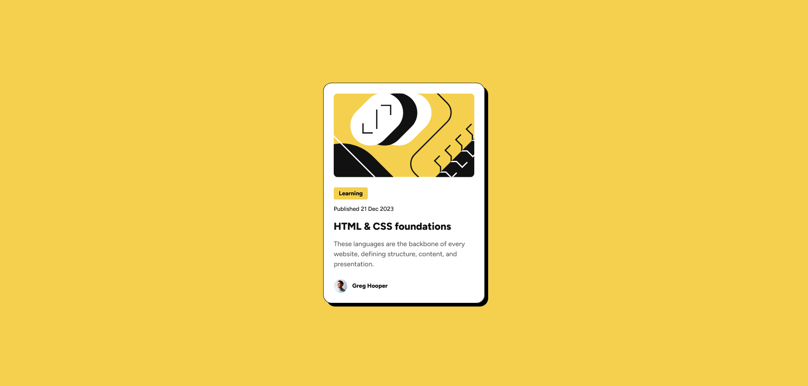

# Frontend Mentor - Blog preview card solution

This is a solution to the [Blog preview card challenge on Frontend Mentor](https://www.frontendmentor.io/challenges/blog-preview-card-ckPaj01IcS). Frontend Mentor challenges help you improve your coding skills by building realistic projects.

## Table of contents

- [Overview](#overview)
  - [The challenge](#the-challenge)
  - [Screenshot](#screenshot)
  - [Links](#links)
- [My process](#my-process)
  - [Built with](#built-with)
  - [What I learned](#what-i-learned)
  - [Continued development](#continued-development)
  - [Useful resources](#useful-resources)
- [Author](#author)

## Overview

### The challenge

Users should be able to:

- See hover and focus states for all interactive elements on the page

### Screenshot



### Links

- Solution URL: [Frontend Mentor](https://www.frontendmentor.io/solutions/blog-preview-card-using-tailwindcss-YUdnkSPsxJ)
- Live Site URL: [Vercel](https://jyln-blog-preview-card-challenge.vercel.app/)

## My process

### Built with

- Semantic HTML5 markup
- Flexbox
- Mobile-first workflow
- [TailwindCSS][tailwinddocs]
- [Parcel](https://parceljs.org/docs) - for simple static site building

### What I learned

As I continue using TailwindCSS, I continue to learn new things regarding the framework. For example, as I was refactoring my code during this project, I found out that you can simply attach a line height modifier to the font size utility class. Before I was doing this:

```html
<div class="text-sm leading-normal sm:text-lg sm:leading-normal"></div>
```

However with the modifier, I can cut out an unnecessary utility class like this:

```html
<div class="text-sm/normal sm:text-lg/normal"></div>
```

### Continued development

During this project, I initially used the `ring` utility class within Tailwind to produce the border around the card component. I did this because I was overtly focused on the "inside" border setting within the Figma design file for this project. It wasn't until refactoring my code, that I rememebered that Tailwind sets the `box-sizing` for every element as `border-box`, and borders are inherently inside the element with this box model setting.

All that to say, while coding designs, I would to focus more on remembering the fundamentals of the CSS language as I am piecing things together.

### Useful resources

- [TailwindCSS Docs][tailwinddocs]

## Author

- Website - [JYLN](https://jyln.dev)
- Frontend Mentor - [@JYLN](https://www.frontendmentor.io/profile/JYLN)

[tailwinddocs]: https://tailwindcss.com/docs
